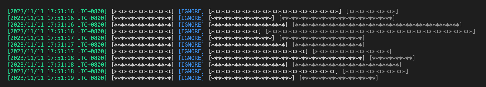

# Mail Center   邮件中心  
基于 Python 与 imbox 的邮件预处理中心，支持已读标记、删除邮件  

## **依赖**  
- `imbox` 库  

## **功能/使用说明**  
- 安装/运行  
  - 克隆本存储库：`git clone https://github.com/Geraniol/MailCenter.git`  
  - 建议通过 `python3 -m venv` 创建虚拟环境  
  - 通过 `pip3 install imbox` 安装依赖  
  - 运行：`python3 mailcenter.py`  
- 自动标记邮件为已读  
  - 编辑/创建 `./mail_ignore.txt`，将需要标记为已读的邮件地址按行写入  
- 自动删除邮件  
  - 编辑/创建 `./mail_delete.txt`，将需要删除的邮件地址按行写入  
- 程序 `mailcenter.py` 中可自定义参数与默认值：  
  - 内部参数  
    - `POLLING` = `30` 邮件轮询间隔（秒）  
    - `QUIET` = `False` 不打印输出  
    - `NOCOLOR` = `False` 关闭彩色输出  
    - `TIMESTAMP` = `True` 打印时间戳  
    - `SSL` = `True` 开启 ssl 认证  
  - 外部参数  
    - `FILEPATH_MAIL_ACCOUNT` = `./mail_account.json` 账户信息之文件路径  
    - `FILEPATH_MAIL_IGNORE` = `./mail_ignore.txt` 需要标记为已读的邮箱之文件路径  
    - `FILEPATH_MAIL_DELETE` = `./mail_delete.txt` 需要删除的邮箱之文件路径  
- 目前仅支持 `imap` 协议邮箱  
- 支持热更新邮箱列表，无需重启程序  

## **问题**  
- 无法登陆邮箱  
  - 检查 `./mail_account.json` 中的账户信息是否正确  
  - 在 `./mailcenter.py` 中关闭 ssl 认证：`SSL = False`  

## **运行预览**  
  
- 时间戳（可选）  
- 账户（邮件接收方邮箱）  
- 邮件处理方式（忽略IGNORE/删除DELETE）  
- 邮件发送方邮箱  
- 邮件标题  
